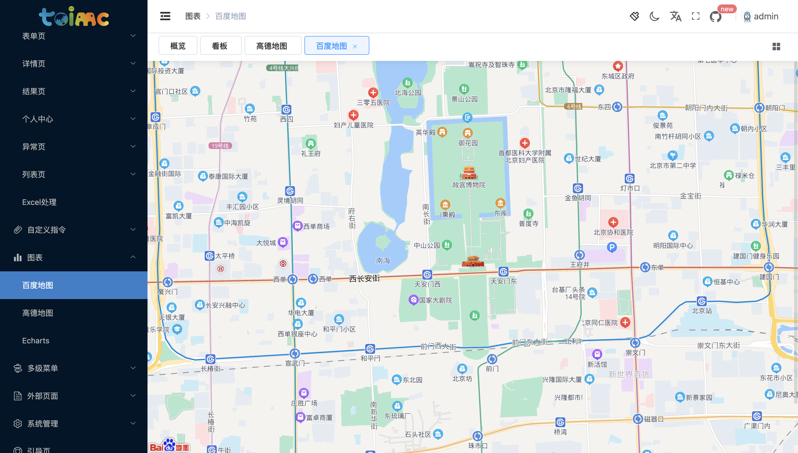

# 百度地图


## 效果




## 用法

```vue
<template>
  <div ref="wrapRef" :style="{ height, width }"></div>
</template>
<script lang="ts">
  import { defineComponent } from 'vue'

  import { useScript } from '@/hooks/useScript'

  const BAI_DU_MAP_URL =
    'https://api.map.baidu.com/getscript?v=3.0&ak=GBUMGmG7VVnSmBSK7TS6py2GoPQzQmd6&services=&t=20210201100830&s=1'
  export default defineComponent({
    name: 'BaiduMap',
    props: {
      width: {
        type: String,
        default: '100%'
      },
      height: {
        type: String,
        default: 'calc(100vh - 90px)'
      }
    },
    setup() {
      const wrapRef = ref<HTMLDivElement | null>(null)
      const { toPromise } = useScript({ src: BAI_DU_MAP_URL })

      async function initMap() {
        await toPromise()
        await nextTick()
        const wrapEl = unref(wrapRef)
        if (!wrapEl) return
        const BMap = (window as any).BMap
        const map = new BMap.Map(wrapEl)
        const point = new BMap.Point(116.404, 39.915)
        map.centerAndZoom(point, 15)
        map.enableScrollWheelZoom(true)
      }

      onMounted(() => {
        initMap()
      })

      return { wrapRef }
    }
  })
</script>
```


## 属性

```ts
// 地图展示区域的宽
width: {
  	type: String,
    default: '100%'
},
// 地图展示区域的高
height: {
    type: String,
    default: 'calc(100vh - 78px)'
}
```

