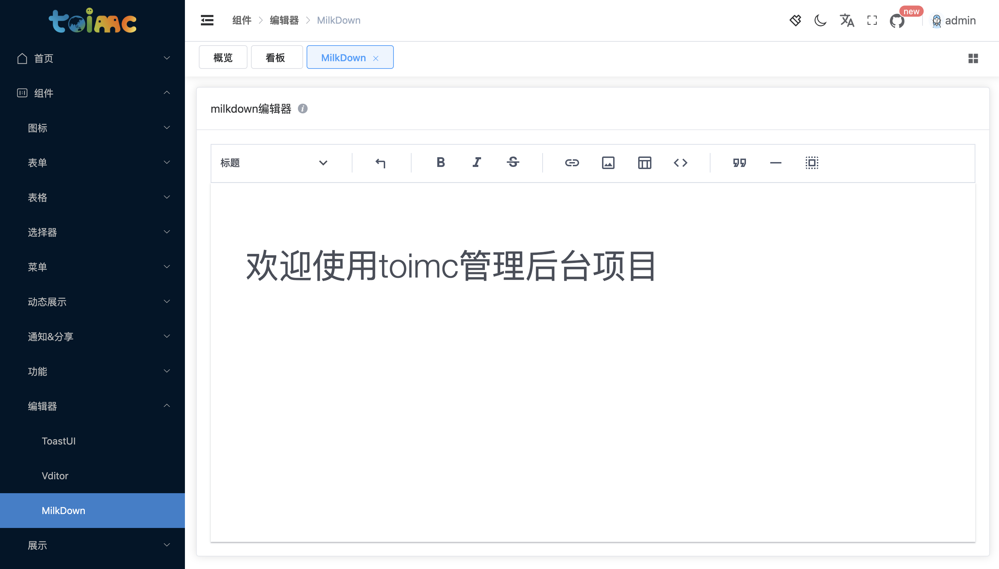

# MilkDown

[Milkdown](https://milkdown.dev/zh-hans/getting-started) 是一个轻量但强大的 WYSIWYG（所见即所得）的 markdown 编辑器。它有两部分组成：

- 一个小巧的核心，提供了插件加载器和一些内置插件。
- 大量的插件，包括语法、命令和组件。


## 特性

- **所见即所得的 Markdown** - 以一种优雅的方式编写 markdown
- **可定制主题** - 主题可以通过 npm 包安装和共享
- **可交互** - 通过插件支持你的脑洞
- **值得信赖** - 基于 [prosemirror](https://prosemirror.net/) 和 [remark](https://github.com/remarkjs/remark) 构建
- **斜线指令和工具条** - 让任何人都可以使用，通过插件
- **数学支持** - LaTeX 数学公式支持，通过插件
- **表格支持** - 拥有流畅的 ui 的表格支持，通过插件
- **协同编辑** - 基于 [yjs](https://docs.yjs.dev/) 的协同编辑支持，通过插件
- **剪贴板** - 支持 markdown 格式的复制粘贴，通过插件
- **Emoji** - 支持 emoji 快捷指令和选择器，通过插件


## 效果




## 用法

```vue
<milkdown :default-value="'# 欢迎使用toimc管理后台项目'"></milkdown>
```


## 属性

```ts
// 编辑器中默认值
defaultValue: {
  type: String,
  default: ''
},
// 菜单
menu: {
  type: Array as PropType<MenuType[]>,
  default: () => ['diagram', 'tooltip', 'math', 'upload', 'slash', 'menu']
}
```


## Events

```ts
emits: ['beforeMount', 'mounted', 'updated', 'markdownUpdated', 'blur', 'focus', 'destory']
```

